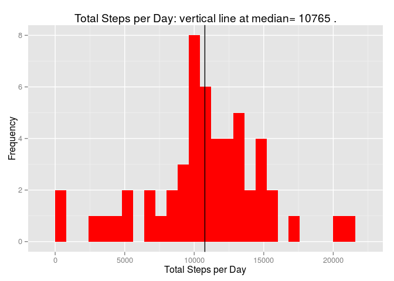
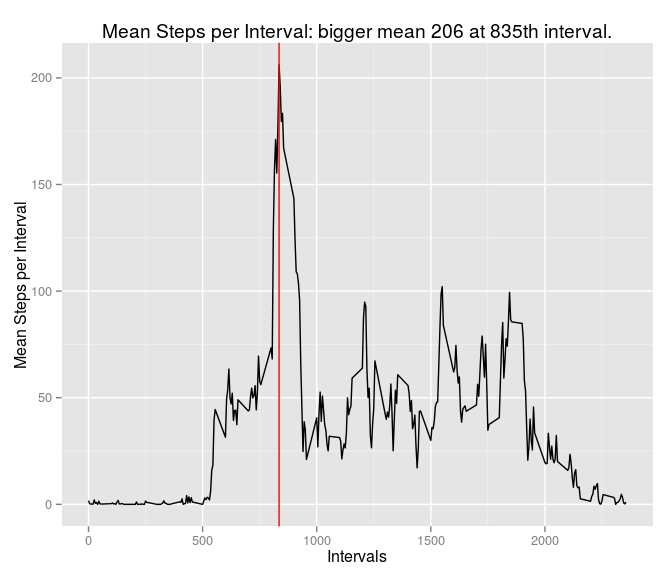
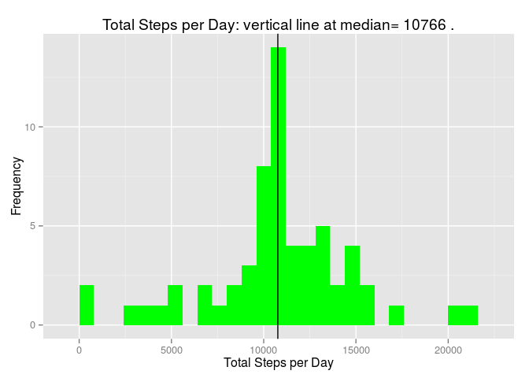
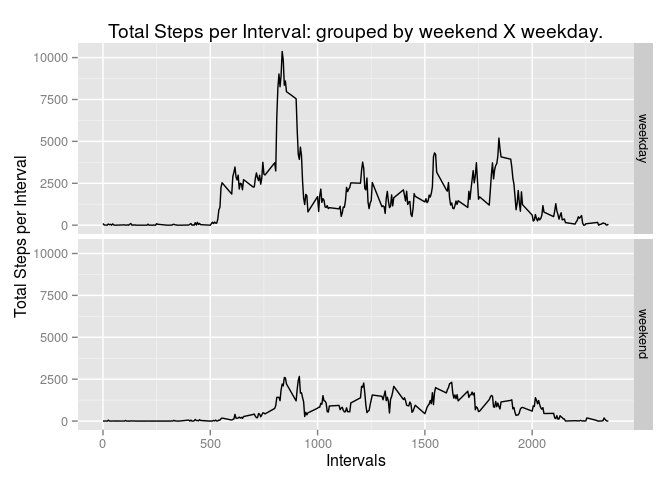
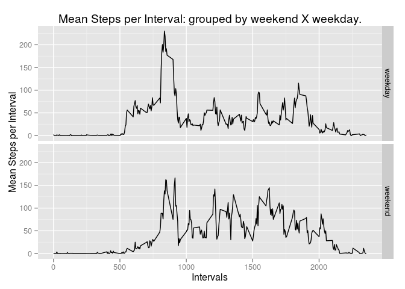

# Reproducible Research: Peer Assessment 1

### Introduction from [repo](https://github.com/rdpeng/RepData_PeerAssessment1).

It is now possible to collect a large amount of data about personal
movement using activity monitoring devices such as a
[Fitbit](http://www.fitbit.com), [Nike
Fuelband](http://www.nike.com/us/en_us/c/nikeplus-fuelband), or
[Jawbone Up](https://jawbone.com/up). These type of devices are part of
the "quantified self" movement -- a group of enthusiasts who take
measurements about themselves regularly to improve their health, to
find patterns in their behavior, or because they are tech geeks. But
these data remain under-utilized both because the raw data are hard to
obtain and there is a lack of statistical methods and software for
processing and interpreting the data.

This assignment makes use of data from a personal activity monitoring
device. This device collects data at 5 minute intervals through out the
day. The data consists of two months of data from an anonymous
individual collected during the months of October and November, 2012
and include the number of steps taken in 5 minute intervals each day.

The document was produced with **R version 3.1.2 at a i686-pc-linux-gnu (32-bit) Ubuntu**, also we settled the local time -  _it shall be resettled in the end_ - and global options for knitr:  


```r
knitr::opts_chunk$set(echo=TRUE)
local <- Sys.getlocale(category = "LC_TIME")
Sys.setlocale("LC_TIME", "en_US.UTF-8")
```

```
## [1] "en_US.UTF-8"
```

Calling libraries:  

```r
library(knitr)
library(dplyr)
```

```
## 
## Attaching package: 'dplyr'
## 
## The following object is masked from 'package:stats':
## 
##     filter
## 
## The following objects are masked from 'package:base':
## 
##     intersect, setdiff, setequal, union
```

```r
library(tidyr)
library(magrittr)
```

```
## 
## Attaching package: 'magrittr'
## 
## The following object is masked from 'package:tidyr':
## 
##     extract
```

```r
library(lubridate)
library(xtable)
library(ggplot2)
library(pracma)
```

```
## 
## Attaching package: 'pracma'
## 
## The following objects are masked from 'package:magrittr':
## 
##     and, mod, or
```

### Loading and preprocessing the data

We traded `https` for `http` to download and unzip the file on this operating system from [link](https://d396qusza40orc.cloudfront.net/repdata%2Fdata%2Factivity.zip). 


```r
workdir <- getwd()
download.file("http://d396qusza40orc.cloudfront.net/repdata%2Fdata%2Factivity.zip"
              ,destfile="zipado.zip")
unzip(zipfile="zipado.zip", files = NULL, list = FALSE, overwrite = TRUE,
      junkpaths = FALSE, exdir = workdir, unzip = "internal",
      setTimes = FALSE)
data_original <- tbl_df(read.csv("activity.csv", header = TRUE, sep = ","))
time <- format(Sys.time(),"%a %b %d %X %Y")
```

The current time is Sun Jan 18 06:46:46 PM 2015.

### What is mean total number of steps taken per day?   

I ignored the missing values as recommended for two following tasks: 

* Make a histogram of the total number of steps taken each day  

* Calculate and report the mean and median total number of steps taken per day  


```r
data1 <- data_original
data1$date %<>% ymd
sum_data1  <- data1 %>%
                group_by(date) %>%
                        summarize(total_steps=sum(steps))
media <- mean(sum_data1$total_steps,na.rm=TRUE)
desvio_padrao <- sd(sum_data1$total_steps,na.rm=TRUE)
mediana <- median(sum_data1$total_steps,na.rm=TRUE)
```

Our calculations: the **mean** 10766 $\pm $ 4269 or in another notation 10800(4300) total number of steps taken per day and **median** 10765 total number of steps taken per day. See the following histogram:


```r
titulo <- paste("Total Steps per Day: vertical line at median=",mediana,".")
ggplot(sum_data1,aes(x=total_steps))+
geom_histogram(binwidth = 800,fill = "red")+
geom_vline(data=sum_data1,aes(xintercept = mediana))+
xlab("Total Steps per Day")+
ylab("Frequency")+
ggtitle(titulo)
```

 

### What is the average daily activity pattern?  

Two tasks: 

* Make a time series plot of the 5-minute interval (x-axis) and the average number of steps taken, averaged across all days (y-axis). 

* Which 5-minute interval, on average across all the days in the dataset, contains the maximum number of steps?  

I choose to don't display the error bars because large dispersion:  


```r
meansteps_byinterval<-data1%>%group_by(interval) %>%
                        summarise(steps_average=mean(steps,na.rm=TRUE),steps_sd=sd(steps,na.rm=TRUE))
max_mean<-max(meansteps_byinterval$steps_average)
index <- which(meansteps_byinterval$steps_average==max_mean)
which_interval <- meansteps_byinterval$interval[index]
xt <- summary(meansteps_byinterval)
print(xt,type="html")
```

```
##     interval      steps_average        steps_sd     
##  Min.   :   0.0   Min.   :  0.000   Min.   :  0.00  
##  1st Qu.: 588.8   1st Qu.:  2.486   1st Qu.: 10.36  
##  Median :1177.5   Median : 34.113   Median : 90.76  
##  Mean   :1177.5   Mean   : 37.383   Mean   : 82.98  
##  3rd Qu.:1766.2   3rd Qu.: 52.835   3rd Qu.:126.35  
##  Max.   :2355.0   Max.   :206.170   Max.   :293.00
```

We present the plot with a circadian-like variations:


```r
titulo <- paste("Mean Steps per Interval: bigger mean ",format(max_mean, digits=3)," at ",which_interval,"th interval.",sep="")
ggplot(meansteps_byinterval,aes(x=interval,y=steps_average))+
geom_line()+
geom_vline(data=meansteps_byinterval,aes(xintercept = which_interval),col="red")+
xlab("Intervals")+
ylab("Mean Steps per Interval")+
ggtitle(titulo)
```

 

The interval, on average across all the days in the dataset, that contains the maximum number of steps per five minutes was 835th with 206 average steps per  interval.

### Imputing missing values  


```r
NA_number <- sum(is.na(data1[,1]))
```

We have 2304 _NAs_ at variable **steps** of original data and the presence of missing days may introduce bias into some calculations or summaries of the data.

We filled in the missing values of **steps** in the new dataset **data2** with the 5-minute interval means for influence each interval homogeneously. We calculated these means with all **steps**' values for each interval of all days.


```r
data1 %<>% mutate(flag_NA=is.na(steps)) 
data2 <- inner_join(data1, meansteps_byinterval, by = "interval")       
for(i in 1:17568){
        if(data2[i,4]==TRUE){
                data2[i,1] <- data2[i,5]
                }
        }
sum_data2  <- data2 %>%
                group_by(date) %>%
                        summarize(total_steps=sum(steps))
media2 <- mean(sum_data2$total_steps,na.rm=TRUE)
desvio_padrao2 <- sd(sum_data2$total_steps,na.rm=TRUE)
mediana2 <- median(sum_data2$total_steps,na.rm=TRUE)
z_test <- (media2-media)/sqrt(desvio_padrao^2+desvio_padrao2^2)
```

We maked a new data's histogram with a vertical line at median 10766 steps per day


```r
titulo <- paste("Total Steps per Day: vertical line at median=",format(mediana2,digits=5),".")
ggplot(sum_data2,aes(x=total_steps))+
geom_histogram(binwidth = 800,fill = "green")+
geom_vline(data=sum_data2,aes(xintercept = mediana2))+
xlab("Total Steps per Day")+
ylab("Frequency")+
ggtitle(titulo)
```

 

This histogram was very similar, but there was a small peak shift to the right. Then we report that mean presented less dispersion in new data, but its value didn't differ from original data's mean as well as the median values of total number of steps taken per day. See the table below:

|          Data           | mean $\pm $ sd | z test(mean) |  median  |
| ----------------------- | -------------- | ------------ | -------- |
| Original data with _NA_ | 10766 $\pm $ 4269  | 0       | 10765         |
| New data without _NA_   | 10766 $\pm $ 3974 | 0      | 10766        |

### Are there differences in activity patterns between weekdays and weekends?

As recomended for this part we used the weekdays() function and **data2** that is a dataset with the filled-in missing values for this part. Also we created a new factor variable named **week** in this dataset with two levels – _“weekday”_ and _“weekend”_ - indicating whether a given date is a weekday or weekend day. 


```r
data2 %<>% mutate(week="weekday")
for(i in 1:17568){
        if((weekdays(data2$date[i])=="Sunday") | (weekdays(data2$date[i])=="Saturday")){
                data2$week[i] <- "weekend"
                }
        } 
data2$week %<>% as.factor
sum_week  <- data2 %>%
                group_by(interval,week) %>%
                        summarize(total_steps=sum(steps)) 

sum_weekend <- sum_week %>%
                        filter(week=="weekend")
auc_weekend <- -1*trapz(sum_weekend$total_steps,sum_weekend$interval)

sum_weekday <- sum_week %>%
                        filter(week=="weekday")
auc_weekday <- -1*trapz(sum_weekday$total_steps,sum_weekday$interval)

activity_diff <- 100*auc_weekend/auc_weekday
```

We maked a panel plot containing a time series plot of the 5-minute interval (x-axis) and the total number of steps taken, averaged across all weekday days or weekend days (y-axis):


```r
titulo <- paste("Total Steps per Interval: grouped by weekend X weekday.")
ggplot(sum_week,aes(x=interval,y=total_steps))+
geom_line()+
facet_grid(week~.)+
xlab("Intervals")+
ylab("Total Steps per Interval")+
ggtitle(titulo)
```

 

We can see that there was a similar variation of the circadian-like cycle in both groups; this similarity was much higher in those rest periods.

The activity was higher on weekdays: unlike the weekend whose peaks hardly reached 2500 steps per interval; those of weekdays activity peaks often passing the limit of 2500 and sometimes exceeded the barrier of 10,000 steps per interval.

The areas under curves on this plot is another way to measure activity. The weekend activity is only  44.5%  of weekday activity.

At least we maked a panel plot containing a time series plot of the 5-minute interval (x-axis) and the average number of steps taken, averaged across all weekday days or weekend days (y-axis):


```r
mean_week  <- data2 %>%
                group_by(interval,week) %>%
                        summarize(mean_steps=mean(steps))

mean_weekend <- mean_week %>%
                        filter(week=="weekend")
auc_weekend2 <- -1*trapz(mean_weekend$mean_steps,mean_weekend$interval)

mean_weekday <- mean_week %>%
                        filter(week=="weekday")
auc_weekday2 <- -1*trapz(mean_weekday$mean_steps,mean_weekday$interval)

activity_diff2 <- 100*auc_weekday2/auc_weekend2
```

Pay attention to following plot:


```r
titulo <- paste("Mean Steps per Interval: grouped by weekend X weekday.")
ggplot(mean_week,aes(x=interval,y=mean_steps))+
geom_line()+
facet_grid(week~.)+
xlab("Intervals")+
ylab("Mean Steps per Interval")+
ggtitle(titulo)
```

 

We can see that there was a more similar variation of the circadian-like cycle in both averaged groups than added groups and as well the similarity in those rest periods. We used the areas under curves to measure activity and the mean weekday activity is 79.9%  of mean weekend activity without improvement in the ability to differentiate.

The weekday averaged activity was similar to weekend one and this left me with more unanswered questions. What kind of activity is the most beneficial for health: the more regular or one that is more extensive? This device with another accompaniments together can discern the effects of different lifestyles, some more phasic and anothers more regular... Anyway the accumulated activity has improved the rating of the activities on weekends and on weekdays. At least the weekend had had two days and weekdays five, so the averaged groups' evaluation can be more precise.


```r
Sys.setlocale("LC_TIME", local)
```

```
## [1] "pt_BR.UTF-8"
```
